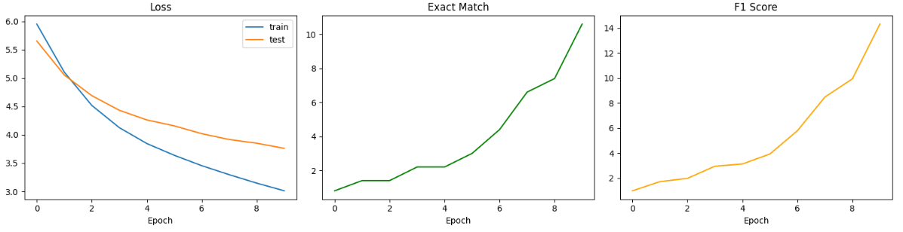
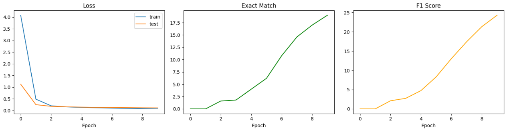

# QA-Augmentation

## 프로젝트 개요
GPT-3.5를 활용한 데이터 증강이 한국어 QA 모델 성능에 미치는 영향 분석

## 참고 논문
GPT3Mix: Leveraging Large-scale Language Models for Text Augmentation (Yoo et al., 2021)
https://arxiv.org/abs/2104.08826

## 프로젝트 동기
GPT3Mix 논문을 읽으면서 LLM으로 데이터를 증강하는 아이디어에 흥미를 느꼈습니다.

논문은 분류 태스크(감성분석 등)에서 GPT로 새로운 문장을 생성해 
성능을 높이는 방식이었는데, 이를 QA 태스크에 적용하면 어떨까 라는 
의문에서 프로젝트를 시작했습니다.

분류와 달리 QA는 context가 고정된 상태에서 
질문의 다양성이 성능에 영향을 줄 수 있다고 판단했고,
GPT로 동일한 context에서 다양한 표현의 질문을 생성하는 방식으로
논문의 아이디어를 응용했습니다.

간단하게 방향을 설명하자면, RT20 데이터셋에 GPT3Mix모델로 새로운 문장을 생성해 학습데이터를 늘려
BERT-base, DistilBERT 모델로 감정 분류를 하는 흐름으로 논문이 작성되었습니다.
이를 기반으로 QA 데이터셋에 context에 추가적인 질문을 생성하여 학습하면 더 정확하게 정답을 예측할까?라는
감정 분류가 아닌 QnA 기반 데이터에 GPT 모델로 증강하여 T5 모델로 answer를 예측하고자 합니다.


## 실험 구성
| 실험 | 학습 데이터 | 결과 |
|------|------------|------|
| Baseline | 원본 3,000개 | Loss:0.15 / EM:2.8 / F1:3.5 |
| Augmented | 원본 + 증강 9,000개 | Loss:0.11 / EM:19.2 / F1:23.6 |

## 폴더 구조
```
QA-Augmentation/
├── data/
│   ├── train_sampled.csv       # 원본 학습 데이터 (3,000개)
│   ├── test_sampled.csv        # 테스트 데이터 (500개, 고정)
│   ├── train_augmented.csv     # GPT 증강 데이터 (9,000개)
│   └── wrong_cases.csv         # 예측 실패 데이터 (404개)
├── notebooks/
│   ├── 01_baseline_T5.py       # 원본 데이터로 T5 학습
│   ├── 02_text_augmentation.py # GPT-3.5로 질문 증강
│   └── 03_augmented_T5.py      # 증강 데이터로 T5 학습 및 최적화 모델과 예측 실패 데이터 도출
└── results/                    # 시각화 그래프 저장
```


## 모델
- **T5**: paust/pko-t5-small
- **Augmentation**: gpt-3.5-turbo

## 데이터셋
- **KorQuAD 1.0**": 한국어 위키피디아 기반 QA 데이터셋


## 결과
### baseline
 <br/>
### augmentation



